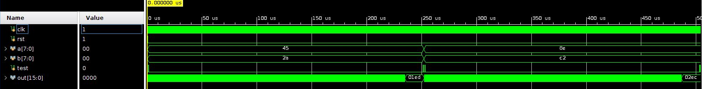

<!-- федеральное государственное автономное образовательное учреждение высшего образования
«Национальный исследовательский университет ИТМО» -->

# Лабораторная работа №4 &laquo;Функциональная схемотехника&raquo;

Выполнили студенты группы P33113:  Доморацкий Э.А., Юров М.А.

Преподаватель: Тищук Б.Ю.

Санкт-Петербург, 2021

Цель работы
=======

Получить навыки разработки встроенных схем самотестирования (BIST, built-in self-test) для цифровых устройств, реализованных на базе программируемых логических интегральных схем (ПЛИС).

Вариант:

Схемы устройств
===============
BIST control logic:

Внешний LFSR-регистр:

Внутренний LFSR-регистр:

Модуль расчёта CRC8:

Код схемы
==========

Репозиторий: https://github.com/theotheruser2/schemelab4  

imports - директория с элементами исходной ПЛИС:

`sqrt.v` - блок вычисления квадратного корня\
`a_sqrtb.v` - схема для вычисления значения функции\
`multiplier.v` - блок умножения

new - директория с элементами, созданными для данной лабораторной работы:

`bist.v` - модуль "BIST control logic"\
`button.v` - LPF-фильтр\
`crc8.v` - модуль расчёта CRC8\
`lfsr.v` - внешний регистр LFSR\
`lfsr2.v` - внутренний регистр LFSR

Код разработанного тестового окружения 
=======================================

imports - директория с тестовым исходной ПЛИС:

`ab_tb.v` - тестирование блока вычисления квадратного корня\
`s_test.v` - тестирование работы схемы в целом

new - директория с тестовым окружением, созданным для данной лабораторной работы:

`bist_tb.v` - тестирование модуля "BIST control logic"\
`button_tb.v` - тестирование LPF-фильтра\
`crc8_tb.v` - тестирование модуля расчёта CRC8\
`lfsr_tb.v` - тестирование внешних регистров LFSR

Файл ограничений
================

`constraints.xdc`

Файл прошивки
=============

`bist.bit`

Результат тестирования блока в симуляторе
========================================
Временная диаграма тестирования. Сигналы подаются с частотой 100 МГц:

Все значения операндов, перебираемые в режиме самотестирования, попадают в область допустимых значений для функции `y = a * √b`, где `a`, `b` - целые беззнаковые числа разрядностью восемь бит. `a, b ∈ [0; 255]`.\
Результаты и время моделирования в режиме самотестирования:

Потребление ресурсов
====================

Полученные на основе симуляции данные об использовании ресурсов устройства, энергопотреблении, температуре:

Вывод
=====

В результате работы нами была создана схема самотестирования для разработанной для прошлой лабораторной работы ПЛИС на языке Verilog, а также имплементирован RC-фильтр низких частот для защиты от воздействия дребезга контактов на работу схемы.
